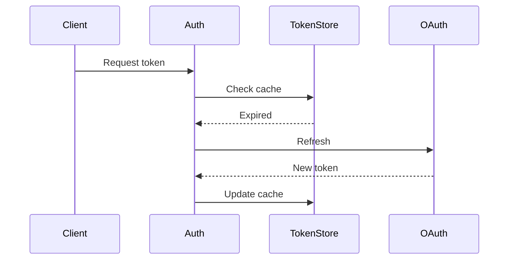

# 023 — Task Artifacts

Rich visual outputs attached to tasks — diagrams, interactive dashboards, charts, and more.

## Problem

Workers produce valuable visual and structured content during task execution — architecture diagrams, dependency graphs, migration progress charts, API flow visualizations. Today, the only place for this content is the **notes** field (free-form markdown) or **terminal output** (raw text). Notes work well for narrative commentary but are the wrong container for named, standalone visual deliverables. A worker that produces both a progress journal *and* an architecture diagram currently has to mush them into a single text blob.

## Solution

Add a first-class **artifacts** system to tasks. An artifact is a named, typed piece of rich content attached to a task. Workers create artifacts via a new `orch-artifact` CLI command. The frontend renders each artifact with a type-appropriate viewer.

## Design Principles

### Artifacts vs. Notes: Clear Separation

| Concern | Notes | Artifacts |
|---|---|---|
| **Purpose** | Narrative — what happened, why, what's next | Deliverable — a named output to reference or revisit |
| **Format** | Append-friendly prose (markdown) | Named, typed, replaceable (html, markdown) |
| **Reading pattern** | Top-to-bottom, chronological | By name — "show me the Architecture Diagram" |
| **Update model** | Overwrite entire field or append | Update a specific artifact by name, others untouched |
| **Worker guidance** | "Jot your thoughts in notes" | "Create an artifact when you have a standalone visual or document" |

**Rule of thumb for workers:** If you'd title it and someone would search for it by name, it's an artifact. If it's a running observation or decision log, it's a note.

### Inline Mermaid in Notes (Tier 1)

Notes already render as Markdown. By adding Mermaid support to the `<Markdown>` component, workers can embed simple diagrams directly in notes without creating a separate artifact:

````markdown
Investigated the auth flow. Found a race condition in token refresh.



Fixed by adding a mutex around the refresh call.
````

This covers the 70% case where a worker wants a quick inline diagram within its narrative. No new data model needed — just a rendering upgrade to the existing Markdown component.

### HTML Artifacts in Sandboxed Iframes (Tier 2)

For dynamic, interactive content — dashboards that fetch data, complex visualizations with user interaction, anything beyond static diagrams — workers produce self-contained HTML documents rendered in sandboxed iframes.

**Why iframes, not MDX or runtime React compilation:**

1. **Security.** MDX compiles to React components in the main webview process, which in Tauri has access to `window.__TAURI__` (filesystem, shell, IPC). A sandboxed iframe (`sandbox="allow-scripts"` without `allow-same-origin`) cannot access the parent window, Tauri APIs, cookies, or localStorage.

2. **Simplicity.** HTML artifacts need zero compilation infrastructure — no MDX compiler, no import resolution, no bundler. The browser renders them natively.

3. **LLM accuracy.** LLMs produce correct self-contained HTML far more reliably than correct React/MDX (no hooks rules, no import paths, no JSX quirks). A worker can include any library via CDN `<script>` tags.

4. **Error isolation.** A broken HTML artifact is contained in its iframe. A broken MDX component crashes the React tree it's embedded in.

---

## Data Model

### New Table: `artifacts`

```sql
CREATE TABLE artifacts (
    id TEXT PRIMARY KEY,
    task_id TEXT NOT NULL REFERENCES tasks(id),
    name TEXT NOT NULL,              -- "Architecture Diagram", "PR Dashboard"
    artifact_type TEXT NOT NULL,     -- "html", "markdown"
    content TEXT NOT NULL,           -- Raw content (HTML document, markdown text)
    created_at TIMESTAMP DEFAULT CURRENT_TIMESTAMP,
    updated_at TIMESTAMP DEFAULT CURRENT_TIMESTAMP,
    UNIQUE(task_id, name)           -- One artifact per name per task
);

CREATE INDEX idx_artifacts_task ON artifacts(task_id);
```

**Fields:**

- **`name`** — Human-readable title. Unique within a task. Workers update artifacts by name (upsert semantics).
- **`artifact_type`** — Determines which renderer the frontend uses:
  - `html` — Self-contained HTML document rendered in sandboxed iframe
  - `markdown` — Rich markdown document with Mermaid diagram support (rendered via `<Markdown>` component)
- **`content`** — The raw content string. For `html`, this is a complete HTML document. For `markdown`, this is markdown text (which can include ` ```mermaid ` blocks for diagrams).

**Why UNIQUE(task_id, name)?** Workers identify artifacts by name, not ID. `orch-artifact create --name "Architecture"` is an upsert — create if new, update if exists. This prevents duplicate artifacts and makes the worker API idempotent.

### Pydantic Schemas

```python
class ArtifactCreate(BaseModel):
    name: str
    artifact_type: str  # "html" | "markdown"
    content: str

class ArtifactUpdate(BaseModel):
    content: str | None = None
    name: str | None = None  # Rename
    artifact_type: str | None = None
```

### TypeScript Type

```typescript
export interface Artifact {
  id: string
  task_id: string
  name: string
  artifact_type: 'html' | 'markdown'
  content: string
  created_at: string
  updated_at: string
}
```

---

## API

### Endpoints

```
GET    /api/tasks/{task_id}/artifacts          — List all artifacts for a task
GET    /api/tasks/{task_id}/artifacts/{id}     — Get a single artifact
POST   /api/tasks/{task_id}/artifacts          — Create or upsert artifact (by name)
PATCH  /api/tasks/{task_id}/artifacts/{id}     — Update artifact content
DELETE /api/tasks/{task_id}/artifacts/{id}     — Delete artifact
```

### Upsert Behavior (POST)

When a worker POSTs an artifact with a `name` that already exists on the task, the existing artifact's content and type are updated (upsert). This makes the worker CLI idempotent — running the same command twice doesn't create duplicates.

```
POST /api/tasks/{task_id}/artifacts
{
  "name": "Architecture Diagram",
  "artifact_type": "markdown",
  "content": "## Auth Architecture\n\n```mermaid\ngraph TD\n    A-->B\n    B-->C\n```"
}
```

Response: `201 Created` (new) or `200 OK` (updated existing).

### Task Serialization

The task detail endpoint includes an `artifact_count` field so the UI can show a badge without fetching all artifact content:

```json
{
  "id": "...",
  "title": "Implement auth flow",
  "artifact_count": 3,
  ...
}
```

Full artifact content is fetched separately via the artifacts endpoint, keeping the task list lightweight.

---

## Worker CLI: `orch-artifact`

```
Usage: orch-artifact <command> [options]

Commands:
  list                              List artifacts for current task
  create [options]                  Create or update artifact (upsert by name)
  delete --name NAME                Delete artifact by name

Create Options:
  --name NAME                       Artifact name (required)
  --type TYPE                       Type: markdown, html (default: markdown)
  --content CONTENT                 Content string (for short content)
  --content-stdin                   Read content from stdin (for long content)
  --file PATH                       Read content from file

Examples:
  # Markdown with Mermaid diagram (default type)
  orch-artifact create --name "Auth Flow" --content-stdin <<'EOF'
  ## Auth Flow

  ```mermaid
  sequenceDiagram
      Client->>Auth: Login
      Auth->>DB: Verify
      DB-->>Auth: OK
      Auth-->>Client: Token
  ```
  EOF

  # HTML dashboard (from file)
  orch-artifact create --name "PR Dashboard" --type html --file /tmp/dashboard.html

  # Markdown report
  orch-artifact create --name "Migration Report" --content-stdin <<'EOF'
  ## Migration Summary
  - **Tables migrated:** 12/15
  - **Data integrity:** All checksums match
  - **Rollback tested:** Yes

  ```mermaid
  pie title Migration Progress
      "Done" : 12
      "Remaining" : 3
  ```
  EOF

  # Update existing artifact (same name = upsert)
  orch-artifact create --name "Auth Flow" --content-stdin <<'EOF'
  ...updated content...
  EOF

  # Delete
  orch-artifact delete --name "Auth Flow"
```

### Implementation

The script follows the same pattern as `orch-task` and `orch-notify`:
- Sources `lib.sh` for `SESSION_ID`, `API_BASE`, `load_task_info`
- Uses `curl` to hit the artifacts API
- Supports `--content`, `--content-stdin`, and `--file` for flexible content input
- Returns JSON to stdout, errors to stderr

---

## Frontend

### Mermaid in Markdown (Tier 1)

Add Mermaid.js rendering to the existing `<Markdown>` component. When the parser encounters a fenced code block with language `mermaid`, render it as a diagram instead of a code block.

```tsx
// In Markdown.tsx, when rendering a code_block token:
if (token.language === 'mermaid') {
  return <MermaidDiagram key={i} content={token.content} />
}
```

The `<MermaidDiagram>` component:
- Uses `mermaid.render()` to produce SVG
- Renders the SVG inline via `dangerouslySetInnerHTML` (Mermaid output is safe SVG)
- Shows a fallback code block if rendering fails (syntax error in the diagram)
- Respects the dark theme — configure Mermaid with dark theme colors matching `--bg`, `--surface`, `--text-primary`, `--accent`
- Includes a copy button (copy the Mermaid source) and an expand button (full-screen preview)

**Mermaid theme configuration:**

```javascript
mermaid.initialize({
  theme: 'base',
  themeVariables: {
    primaryColor: '#21262d',       // --surface-raised
    primaryTextColor: '#e6edf3',   // --text-primary
    primaryBorderColor: '#30363d', // --border
    lineColor: '#8b949e',          // --text-secondary
    secondaryColor: '#161b22',     // --surface
    tertiaryColor: '#0d1117',      // --bg
    fontFamily: '-apple-system, BlinkMacSystemFont, "Segoe UI", sans-serif',
  },
})
```

### Links & Artifacts Card (Tier 2)

Artifacts share a card with the existing Links section. The card header has pill tabs with counts so the user can switch between the two views without adding a new section to the page.

**Page layout stays the same — no new sections added:**

```
Main content (unchanged section count):
  ┌─ Description
  ├─ Notes (narrative, markdown + inline mermaid)
  ├─ Links & Artifacts (combined card — NEW tab added to existing Links card)
  ├─ Worker Preview (if worker assigned)
  ├─ Subtasks
  └─ Notifications (if any)
```

#### Layout: Combined Card with Tab Switcher

```
┌─────────────────────────────────────────────────────────┐
│  ┌──────────────┐ ┌────────────────────┐                │
│  │ Links (3)    │ │ Artifacts (2)      │          [+ Add]│
│  └──────────────┘ └────────────────────┘                │
├─────────────────────────────────────────────────────────┤
│                                                         │
│  (active tab content rendered here)                     │
│                                                         │
└─────────────────────────────────────────────────────────┘
```

**When "Links" tab is active** — the existing links UI renders exactly as today (link list with tags, add/edit/delete inline forms). No changes to current behavior.

**When "Artifacts" tab is active:**

```
┌─────────────────────────────────────────────────────────┐
│  ┌──────────────┐ ┌────────────────────┐                │
│  │ Links (3)    │ │ Artifacts (2)      │          [+ Add]│
│  └──────────────┘ └────────────────────┘                │
├─────────────────────────────────────────────────────────┤
│ ┌──────────────────┐ ┌──────────────────┐               │
│ │ Architecture     │ │ PR Dashboard     │               │
│ └──────────────────┘ └──────────────────┘               │
│                                                         │
│  ┌───────────────────────────────────────────────────┐  │
│  │                                                   │  │
│  │         (rendered artifact content)                │  │
│  │                                                   │  │
│  └───────────────────────────────────────────────────┘  │
│                                                         │
│  markdown · Updated 2h ago                   [⤢] [✎] [🗑]│
└─────────────────────────────────────────────────────────┘
```

**Design details:**

- **Top-level tabs** ("Links" / "Artifacts") — Pill-style tabs in the card header. Each shows its count in parentheses. Active tab uses `--accent` background at 15% opacity. Count of `0` still shows (e.g., "Artifacts (0)") so the tab is always discoverable. The `[+ Add]` button context switches based on active tab (adds a link or creates an artifact).
- **Artifact sub-tabs** — When the Artifacts tab is active and multiple artifacts exist, a second row of pills lets the user switch between them by name. Single artifact skips this row and renders directly.
- **Viewer area** — Recessed content area (`background: var(--bg)`) inside the `--surface` card. Type-specific renderer fills this area.
- **Footer** — Shows artifact type label, relative timestamp, and action buttons: expand (full-screen), edit (opens source editor), delete (with ConfirmPopover).
- **Default tab** — Links tab is active by default (it's the more common use case today). If a task has artifacts but no links, default to Artifacts tab instead.

#### Type-Specific Renderers

**Markdown Artifacts:**
- Rendered using the existing `<Markdown>` component (which now includes Mermaid support)
- Supports full markdown with inline ` ```mermaid ` blocks for diagrams
- Useful for structured deliverables: architecture docs, specs, reports with embedded diagrams
- Expand button opens a full-screen modal for long documents

**HTML Artifacts:**
- Rendered in a sandboxed iframe:
  ```html
  <iframe
    sandbox="allow-scripts"
    srcdoc={artifact.content}
    referrerpolicy="no-referrer"
    style={{ width: '100%', border: 'none', borderRadius: 'var(--radius)' }}
  />
  ```
- Default height: 400px with a resize handle (drag to expand)
- The iframe has no `allow-same-origin`, so it cannot access parent window, Tauri APIs, cookies, or localStorage
- If the HTML artifact includes fetches to external APIs (GitHub, etc.), they work because `allow-scripts` permits network requests — but CORS rules still apply on the target server
- Expand button opens the artifact in a near-full-screen modal

#### Edit Mode

Clicking the edit button (`✎`) on an artifact opens a source editor:

- **Markdown:** Monaco editor (already in the project) with markdown syntax highlighting, side-by-side with a live preview. Split view: left = source, right = rendered output (including Mermaid diagrams).
- **HTML:** Monaco editor with HTML syntax highlighting. Preview via sandboxed iframe below the editor.
- Save button sends `PATCH /api/tasks/{task_id}/artifacts/{id}`.
- Cancel reverts to view mode.

The edit mode is primarily for the user (the operator) to manually refine worker output. Workers always use the CLI.

#### Create from UI

The `[+ Add]` button (when Artifacts tab is active) opens a creation form:
- Name input (text field)
- Type selector (dropdown: Markdown, HTML)
- Content editor (Monaco, syntax mode matches selected type)
- Save sends `POST /api/tasks/{task_id}/artifacts`.

#### Task Card Badge

On the task board (TaskCard, TaskTable), show an artifact count badge when artifacts exist:

```
┌─────────────────────────────────┐
│ UTI-1  Implement auth flow      │
│ ● In Progress   H   📎 3  🔲 2  │
│                          ↑      │
│                   artifact count │
└─────────────────────────────────┘
```

A small icon + count next to the existing subtask count. Uses `--text-muted` color to avoid visual noise. Only shown when `artifact_count > 0`.

---

## Worker Prompt Update

Add `orch-artifact` to the worker prompt's CLI tools section:

```markdown
### `orch-artifact` — Task Artifacts
Create named visual outputs (diagrams, dashboards, reports) attached to the task. Artifacts are standalone deliverables — use notes for narrative commentary.
```bash
orch-artifact list                                                      # List all
orch-artifact create --name "Name" --content "..."                      # Create/update (markdown)
orch-artifact create --name "Name" --type html --file /tmp/output.html  # HTML from file
orch-artifact create --name "Name" --content-stdin                      # From stdin
orch-artifact delete --name "Name"                                      # Delete
```

**When to use artifacts vs. notes:**
- **Artifact:** Standalone output with a title — diagrams, dashboards, specs, reports
- **Notes:** Running commentary — observations, decisions, progress updates
- You can embed quick diagrams in notes using ` ```mermaid ` blocks — no artifact needed for simple inline diagrams
```

---

## Migration

```sql
-- 031_add_artifacts.sql

CREATE TABLE IF NOT EXISTS artifacts (
    id TEXT PRIMARY KEY,
    task_id TEXT NOT NULL REFERENCES tasks(id) ON DELETE CASCADE,
    name TEXT NOT NULL,
    artifact_type TEXT NOT NULL DEFAULT 'markdown',
    content TEXT NOT NULL DEFAULT '',
    created_at TIMESTAMP DEFAULT CURRENT_TIMESTAMP,
    updated_at TIMESTAMP DEFAULT CURRENT_TIMESTAMP,
    UNIQUE(task_id, name)
);

CREATE INDEX IF NOT EXISTS idx_artifacts_task ON artifacts(task_id);

INSERT OR REPLACE INTO schema_version (version, description)
VALUES (31, 'Add artifacts table for task visual outputs');
```

The `ON DELETE CASCADE` ensures artifacts are automatically cleaned up when a task is deleted.

---

## Implementation Plan

### Phase 1: Mermaid in Markdown

1. Install `mermaid` npm package
2. Create `<MermaidDiagram>` component with dark theme config
3. Update `<Markdown>` parser to detect ` ```mermaid ` blocks and route to `<MermaidDiagram>`
4. Add error boundary / fallback for invalid Mermaid syntax
5. Test with notes field on task detail page (notes already render via `<Markdown>`)

### Phase 2: Artifacts Backend

1. Add migration `031_add_artifacts.sql`
2. Add `Artifact` dataclass to `models.py`
3. Add `orchestrator/state/repositories/artifacts.py` (CRUD + upsert)
4. Add `orchestrator/api/routes/artifacts.py` (REST endpoints)
5. Add `artifact_count` to task serialization
6. Write `orch-artifact` CLI script
7. Update worker prompt with artifact docs

### Phase 3: Artifacts Frontend

1. Add `Artifact` type to `types.ts`
2. Refactor existing Links card into `LinksAndArtifactsCard` with pill tab switcher ("Links (N)" / "Artifacts (N)")
3. Build `ArtifactViewer` component (artifact sub-tabs + type-specific renderers)
4. Wire Links tab to render existing links UI unchanged
5. Wire Artifacts tab to render artifact viewer
6. Add artifact count badge to `TaskCard` / `TaskTable`
7. Build edit mode with Monaco editor + live preview
8. Build create form (reuses `[+ Add]` button, context-aware per active tab)

### Phase 4: Polish

1. Full-screen expand modal for artifacts
2. Resize handle for HTML iframe height
3. Copy source button for artifacts
4. Dark theme tuning for Mermaid diagrams in markdown
5. Keyboard shortcut for navigating artifact tabs

---

## Security

### Sandboxed HTML Iframes

HTML artifacts execute in an iframe with restricted sandbox:

```html
<iframe sandbox="allow-scripts" srcdoc={content} referrerpolicy="no-referrer" />
```

**What the sandbox allows:**
- JavaScript execution (`allow-scripts`)
- Network requests via `fetch()` / `XMLHttpRequest` (subject to CORS)
- CDN script loading via `<script src="...">`

**What the sandbox blocks:**
- Access to parent window (`window.parent`, `window.top` → blocked)
- Access to Tauri APIs (`window.__TAURI__` → not available in iframe)
- Cookies and localStorage of the parent origin
- Form submission to external URLs
- Opening new windows / popups
- Navigation of the parent page

**Key:** The omission of `allow-same-origin` is critical. Without it, the iframe is treated as a unique opaque origin, making it impossible to access the parent's DOM, storage, or APIs regardless of what JavaScript runs inside.

### Content Validation

The backend does not execute or parse artifact content — it stores and serves raw strings. All rendering happens client-side. This means:
- No server-side code execution risk
- No HTML sanitization needed (the iframe sandbox is the security boundary)
- Content size is the only server-side concern (enforce a reasonable max, e.g., 1MB per artifact)

---

## Future Considerations

- **Artifact versioning** — Track content history so users can diff changes over time. Not needed initially (updated_at timestamp is sufficient).
- **Cross-task artifact references** — Link artifacts from one task to another. Useful for architectural diagrams that span multiple tasks. Defer until the need arises.
- **Artifact templates** — Pre-built HTML templates with common libraries (Chart.js, D3) so workers don't need to include CDN links every time. Nice-to-have for Phase 5.
- **Additional artifact types** — If specific patterns emerge (e.g., workers frequently produce charts), consider adding dedicated types with structured data input and built-in renderers. For now, `markdown` (with Mermaid) and `html` cover the full spectrum.
